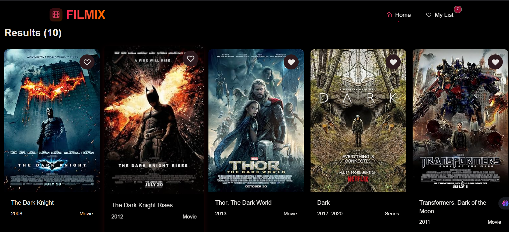

# 🎬 Netflix Clone

A modern movie discovery web application inspired by Netflix. Built with **React 19**, **TypeScript**, and **Vite**, it allows users to search for movies, view details, and save favorites – all powered by the **OMDB API**.

---



---

## 🚀 Technologies Used

| Icon                                                                                                                           | Technology               | Description                              |
|--------------------------------------------------------------------------------------------------------------------------------|--------------------------|------------------------------------------|
|                | **React 19**             | JavaScript library for building UIs      |
|              | **Vite**                 | Next‑generation frontend tooling         |
|      | **TypeScript**           | Typed JavaScript at scale                 |
|       | **TailwindCSS**          | Utility‑first CSS framework               |
|    | **React Router DOM**     | Declarative routing for React            |
|                                                   | **Zustand**              | Lightweight state management             |
|                                  | **OMDB API**             | Movie data source                        |

---

## 🔄 State Management Migration

> **Updated:** This project has been migrated from **Context API + useReducer** to **Zustand** for better state management.

| Feature | Context API + useReducer | Zustand ✅ |
|---------|-------------------------|------------|
| **Boilerplate** | High (Provider, Reducer, Actions) | Minimal (Single store file) |
| **Performance** | Re-renders all consumers on change | Selective subscriptions |
| **TypeScript** | Complex typing | Native & simple typing |
| **DevTools** | Requires setup | Built-in support |
| **Code Lines** | ~100+ lines | ~30 lines |

### Why Zustand?

```bash
# Before (Context API)
<MovieProvider>
  <App />
</MovieProvider>

# After (Zustand)
// Direct import - No provider needed!
const { favorites } = useMovieStore();
```

**Benefits:**
- 🎯 **Less Boilerplate** – No need for providers or context wrappers
- ⚡ **Better Performance** – Components only re-render when subscribed state changes
- 🧩 **Easier Testing** – Store can be imported and tested independently
- 🔌 **DevTools Ready** – Works out of the box with Redux DevTools

---

## ✨ Features

- 🔍 **Search Movies** – Find any movie by title using the OMDB API  
- 📄 **Movie Details** – View full information (plot, cast, ratings, etc.)  
- ❤️ **Favorites** – Add/remove movies to a personal favorites list (persisted in localStorage)  
- 🎨 **Responsive UI** – Styled with TailwindCSS for a smooth experience on all devices  
- ⚡ **Fast Development** – Powered by Vite for instant HMR and builds  
- 🧭 **Client‑side Routing** – Navigate seamlessly with React Router DOM  

---

## 📦 Installation & Setup

Follow these steps to get the project running on your local machine.

1. **Clone the Repository**  
   ```bash
   git clone https://github.com/FahdAmmar/MoviesWebSite  
   ```

2. **Install Dependencies**  
   ```bash
   npm install
   ```

3. **🔑 Configure API Key (Important)**  
   This project uses the OMDB API to fetch movie data. You need a valid API key for the app to work.
   - **Get your Key**: Visit [OMDB API Website](http://www.omdbapi.com/apikey.aspx) and request a free API key (it usually arrives via email).
   - **Create Environment File**: Create a new file named `.env` in the root directory of the project (where `package.json` is located).
   - **Add the Variable**: Paste the following line into your `.env` file, replacing `your_api_key_here` with the key you received:
     ```
     VITE_OMDB_API_KEY=your_api_key_here
     ```

4. **Start the Development Server**  
   ```bash
   npm run dev
   ```

The app will be available at `http://localhost:5173` (or the next available port).

---

## 🏗️ Build for Production

```bash
npm run build
npm run preview   # Serve the production build locally
```

---

## 📁 Project Structure

```
├── 📁 public
│   ├── 🖼️ H.png
│   └── 🖼️ vite.svg
├── 📁 src
│   ├── 📁 assets
│   ├── 📁 components
│   │   ├── 📄 Footer.tsx
│   │   ├── 📄 Header.tsx
│   │   ├── 📄 MovieCard.tsx
│   │   ├── 📄 MovieList.tsx
│   │   └── 📄 SearchBar.tsx
│   ├── 📁 store              # 🆕 Zustand Store
│   │   └── 📄 useMovieStore.ts
│   ├── 📁 pages
│   │   ├── 📄 Favorites.tsx
│   │   ├── 📄 Home.tsx
│   │   └── 📄 MovieDetails.tsx
│   ├── 📁 types
│   │   └── 📄 index.ts
│   ├── 📄 App.tsx
│   ├── 📄 env.d.ts
│   ├── 📄 global.d.ts
│   ├── 🎨 index.css
│   ├── 📄 main.tsx
│   └── ⚙️ tsconfig.json
├── ⚙️ .gitignore
├── 📝 README.md
├── 📄 eslint.config.js
├── 🌐 index.html
├── ⚙️ package-lock.json
├── ⚙️ package.json
└── 📄 vite.config.ts
```

> **Note:** The `context/` folder has been replaced with `store/` for Zustand implementation.

---

## 🎯 How to Use

1. **Search** – Type a movie title in the search bar and press Enter.  
2. **View Details** – Click on any movie card to see full information.  
3. **Favorites** – Click the heart icon on a movie card to add/remove it from your favorites list (accessible via the "Favorites" link in the header).  
4. **Responsive** – The layout adapts to mobile, tablet, and desktop screens.

---

## 🙏 Acknowledgements

- [OMDB API](http://www.omdbapi.com/) for providing movie data  
- [TailwindCSS](https://tailwindcss.com/) for the amazing utility classes  
- [React](https://reactjs.org/) and the open‑source community  
- [Zustand](https://github.com/pmndrs/zustand) for the delightful state management  

---

## 📄 License

This project is [MIT](LICENSE) licensed.

---

**Enjoy exploring movies!** 🍿

---

### 📊 Migration Summary

| Aspect | Before | After |
|--------|--------|-------|
| State Management | Context API + useReducer | Zustand |
| Store Location | `src/context/MovieContext.tsx` | `src/store/useMovieStore.ts` |
| Provider Required | ✅ Yes | ❌ No |
| Lines of Code | ~120 | ~40 |
| Re-renders | All consumers | Subscribed components only |

---
